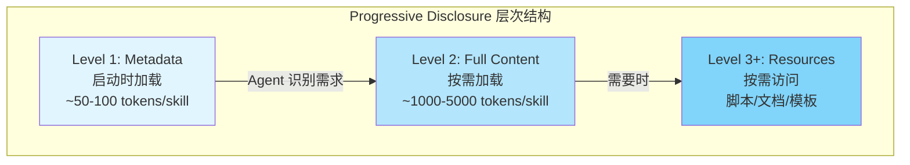
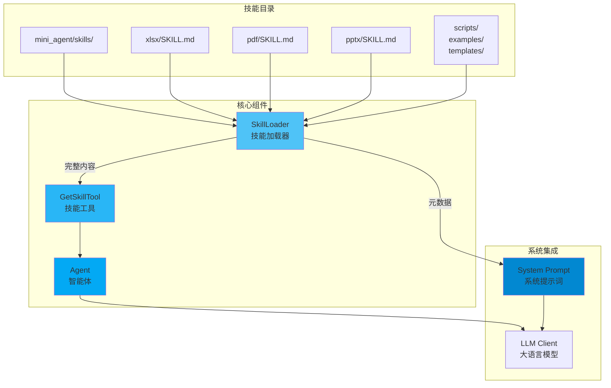
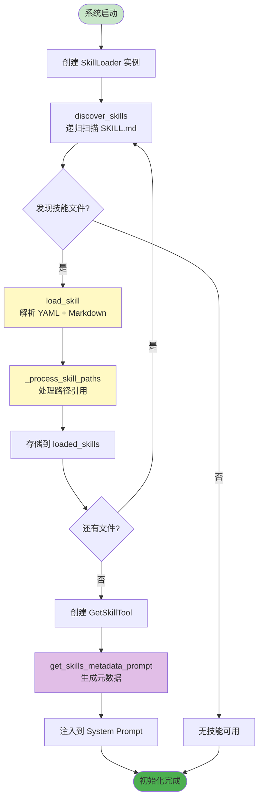
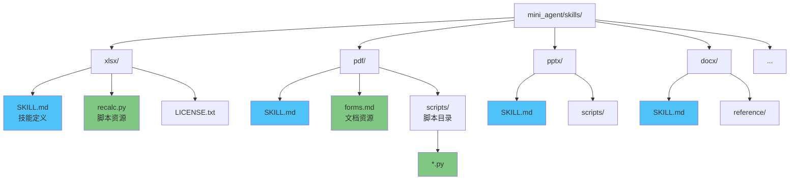
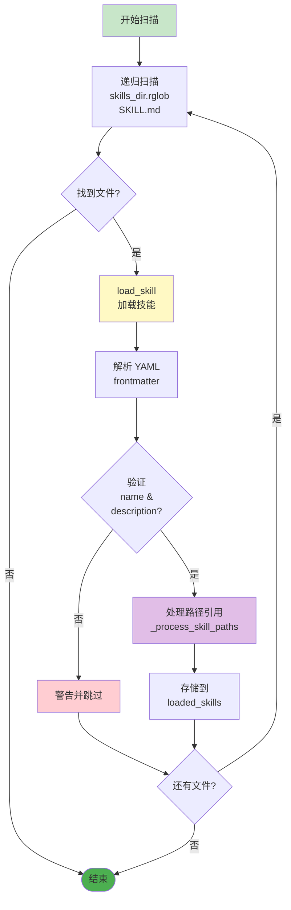
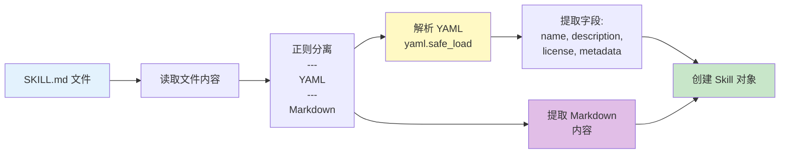
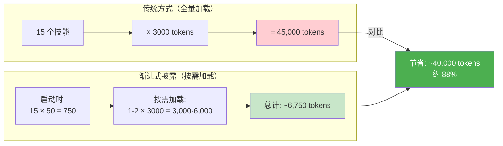
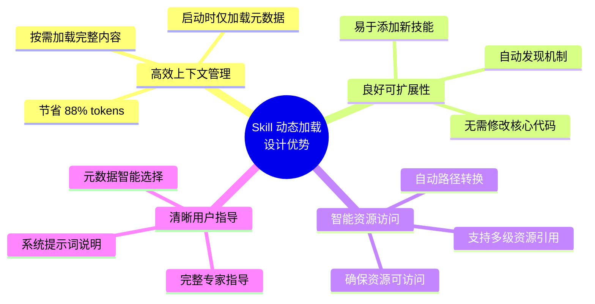

# Skill 动态加载上下文设计文档

## 概述

Mini-Agent 采用**渐进式披露（Progressive Disclosure）**机制实现技能的动态加载，这是一种按需加载的设计模式，旨在优化上下文窗口使用，减少不必要的 token 消耗，同时保持 Agent 对可用技能的感知能力。

## 设计原则

### 渐进式披露（Progressive Disclosure）

技能加载分为三个层次：

- **Level 1 (Metadata)**: 启动时仅加载技能名称和描述
- **Level 2 (Full Content)**: 按需加载技能的完整指导内容
- **Level 3+ (Resources)**: 技能可能引用的额外文件和脚本，按需访问



## 架构设计

### 架构概览



### 1. 核心组件

#### 1.1 SkillLoader (`mini_agent/tools/skill_loader.py`)

负责技能的发现、加载和管理。

**主要功能：**
- `discover_skills()`: 递归扫描技能目录，发现所有 `SKILL.md` 文件
- `load_skill()`: 解析单个技能文件（YAML frontmatter + Markdown 内容）
- `get_skill()`: 获取已加载的技能对象
- `list_skills()`: 列出所有可用技能名称
- `get_skills_metadata_prompt()`: 生成仅包含元数据的提示词（Level 1）

**技能文件格式：**
```yaml
---
name: skill_name
description: Skill description for metadata display
license: MIT
allowed-tools: [tool1, tool2]
metadata:
  category: document
---

# Skill Content (Markdown)
完整的技能指导内容...
```

#### 1.2 GetSkillTool (`mini_agent/tools/skill_tool.py`)

实现 Level 2 的工具接口。

**功能：**
- 提供 `get_skill(skill_name)` 工具
- 按需返回技能的完整内容
- 错误处理：技能不存在时返回可用技能列表

#### 1.3 路径处理机制

`_process_skill_paths()` 方法实现 Level 3+ 的资源路径转换：

**支持的路径模式：**
1. **目录路径**: `scripts/`, `examples/`, `templates/`, `reference/`
   - 模式: `python scripts/file.py` 或 `` `scripts/file.py` ``
   - 转换: 相对路径 → 绝对路径

2. **文档引用**: `see reference.md`, `read forms.md`
   - 模式: `see/read/refer to/check filename.md`
   - 转换: 添加 `use read_file to access` 提示

3. **Markdown 链接**: `[text](path/to/file.md)`
   - 模式: `[link text](relative/path.md)` 或 `[link](./path.md)`
   - 转换: 保留链接文本，转换为绝对路径并添加访问提示

**目的：**
- 确保 Agent 能够正确访问技能引用的资源文件
- 自动将相对路径转换为绝对路径
- 提供明确的文件访问指导

### 2. 初始化流程

#### 2.1 技能发现与加载

```python
# cli.py: initialize_base_tools()
skill_tools, skill_loader = create_skill_tools(skills_dir)
```

**流程：**



#### 2.2 元数据注入

```python
# cli.py: 注入技能元数据到系统提示词
if skill_loader:
    skills_metadata = skill_loader.get_skills_metadata_prompt()
    system_prompt = system_prompt.replace("{SKILLS_METADATA}", skills_metadata)
```

**生成的元数据格式：**
```markdown
## Available Skills

You have access to specialized skills. Each skill provides expert guidance for specific tasks.

Load a skill's full content using the appropriate skill tool when needed.

- `xlsx`: Comprehensive spreadsheet creation, editing, and analysis...
- `pdf`: Comprehensive PDF manipulation toolkit...
- `pptx`: Presentation creation, editing, and analysis...
...
```

### 3. 运行时行为

#### 3.1 Agent 使用流程

```mermaid
sequenceDiagram
    participant User as 用户
    participant Agent as Agent
    participant Prompt as System Prompt<br/>(含元数据)
    participant Tool as GetSkillTool
    participant Loader as SkillLoader
    participant Skill as Skill Content
    participant Resources as 技能资源<br/>(scripts/docs)
    
    User->>Agent: 用户请求<br/>(如: 分析Excel文件)
    Agent->>Prompt: 查看技能元数据
    Prompt-->>Agent: 返回可用技能列表<br/>(Level 1: Metadata)
    Agent->>Agent: 识别相关技能<br/>(如: xlsx)
    Agent->>Tool: get_skill("xlsx")
    Tool->>Loader: get_skill("xlsx")
    Loader-->>Tool: 返回完整技能内容<br/>(Level 2: Full Content)
    Tool-->>Agent: 技能指导文档
    Agent->>Agent: 解析技能指导
    alt 需要访问资源
        Agent->>Resources: read_file(脚本路径)
        Resources-->>Agent: 脚本/文档内容<br/>(Level 3+: Resources)
    end
    Agent->>Agent: 执行任务<br/>(使用相应工具)
    Agent-->>User: 返回结果
```



#### 3.2 实际使用示例

从 `chat_history.log` 中可以看到：

```
Message 2 [user]:
Content: 帮我分析test_data.xlsx里有什么

Message 3 [assistant]:
Content: 我来帮你分析 test_data.xlsx 文件的内容。首先，我会使用 xlsx 技能来读取和分析这个 Excel 文件。

Tool Calls: [
  {
    "id": "call_bea536e760d447259c29c3",
    "type": "function",
    "function": {
      "name": "get_skill",
      "arguments": {
        "skill_name": "xlsx"
      }
    }
  }
]

Message 4 [tool]:
Content: 
# Skill: xlsx
Comprehensive spreadsheet creation, editing, and analysis...
[完整的技能内容]
```

## 设计优势

### 1. Token 效率

- **启动时**: 仅加载元数据（~50-100 tokens per skill）
- **按需加载**: 只在需要时加载完整内容（~1000-5000 tokens per skill）
- **节省**: 对于 15+ 技能，可节省数千 tokens 的上下文窗口

### 2. 可扩展性

- **易于添加**: 只需在技能目录添加 `SKILL.md` 文件
- **自动发现**: 无需修改代码，系统自动发现新技能
- **模块化**: 每个技能独立，互不干扰

### 3. 灵活性

- **按需访问**: Agent 根据任务需求选择加载技能
- **资源引用**: 支持技能引用外部脚本和文档
- **路径处理**: 自动处理相对路径，确保资源可访问

### 4. 用户体验

- **快速启动**: 系统启动时只加载元数据，响应迅速
- **智能选择**: Agent 可以根据元数据智能选择相关技能
- **完整指导**: 加载后获得完整的专家级指导

## 系统提示词集成

### 系统提示词模板 (`mini_agent/config/system_prompt.md`)

```markdown
### 2. **Specialized Skills**
You have access to specialized skills that provide expert guidance and capabilities for specific tasks.

Skills are loaded dynamically using **Progressive Disclosure**:
- **Level 1 (Metadata)**: You see skill names and descriptions (below) at startup
- **Level 2 (Full Content)**: Load a skill's complete guidance using `get_skill(skill_name)`
- **Level 3+ (Resources)**: Skills may reference additional files and scripts as needed

**How to Use Skills:**
1. Check the metadata below to identify relevant skills for your task
2. Call `get_skill(skill_name)` to load the full guidance
3. Follow the skill's instructions and use appropriate tools (bash, file operations, etc.)

{SKILLS_METADATA}
```

### 元数据注入点

在 `cli.py` 中，系统提示词加载后：

```python
# 6. Inject Skills Metadata into System Prompt (Progressive Disclosure - Level 1)
if skill_loader:
    skills_metadata = skill_loader.get_skills_metadata_prompt()
    if skills_metadata:
        system_prompt = system_prompt.replace("{SKILLS_METADATA}", skills_metadata)
```

## 技能目录结构



## 工具接口

### GetSkillTool API

**工具名称**: `get_skill`

**参数**:
```json
{
  "skill_name": "string"  // 技能名称
}
```

**返回**:
- 成功: 技能的完整 Markdown 内容
- 失败: 错误信息和可用技能列表

## 实现细节

### 1. 技能发现机制



```python
# 递归扫描所有 SKILL.md 文件
for skill_file in self.skills_dir.rglob("SKILL.md"):
    skill = self.load_skill(skill_file)
    if skill:
        skills.append(skill)
        self.loaded_skills[skill.name] = skill
```

### 2. YAML Frontmatter 解析



```python
# 使用正则表达式分离 frontmatter 和内容
frontmatter_match = re.match(r"^---\n(.*?)\n---\n(.*)$", content, re.DOTALL)
frontmatter = yaml.safe_load(frontmatter_text)
skill_content = frontmatter_match.group(2).strip()
```

### 3. 路径处理正则表达式

```mermaid
flowchart TD
    CONTENT[技能内容文本] --> PATTERN1[模式1: 目录路径<br/>scripts/, examples/, etc.]
    CONTENT --> PATTERN2[模式2: 文档引用<br/>see/read reference.md]
    CONTENT --> PATTERN3[模式3: Markdown链接<br/>[text](path.md)]
    
    PATTERN1 --> MATCH1{匹配?}
    PATTERN2 --> MATCH2{匹配?}
    PATTERN3 --> MATCH3{匹配?}
    
    MATCH1 -->|是| CONVERT1[转换为绝对路径<br/>skill_dir / rel_path]
    MATCH2 -->|是| CONVERT2[添加访问提示<br/>use read_file to access]
    MATCH3 -->|是| CONVERT3[保留链接文本<br/>转换为绝对路径]
    
    MATCH1 -->|否| SKIP1[保持原样]
    MATCH2 -->|否| SKIP2[保持原样]
    MATCH3 -->|否| SKIP3[保持原样]
    
    CONVERT1 --> RESULT[处理后的内容]
    CONVERT2 --> RESULT
    CONVERT3 --> RESULT
    SKIP1 --> RESULT
    SKIP2 --> RESULT
    SKIP3 --> RESULT
    
    style PATTERN1 fill:#fff9c4
    style PATTERN2 fill:#fff9c4
    style PATTERN3 fill:#fff9c4
    style RESULT fill:#c8e6c9
```

```python
# 目录路径模式
pattern_dirs = r"(python\s+|`)((?:scripts|examples|templates|reference)/[^\s`\)]+)"

# 文档引用模式
pattern_docs = r"(see|read|refer to|check)\s+([a-zA-Z0-9_-]+\.(?:md|txt|json|yaml))([.,;\s])"

# Markdown 链接模式
pattern_markdown = r"(?:(Read|See|Check|Refer to|Load|View)\s+)?\[(`?[^`\]]+`?)\]\(((?:\./)?[^)]+\.(?:md|txt|json|yaml|js|py|html))\)"
```

## 性能考虑

### Token 使用对比



**传统方式（全量加载）**:
- 15 个技能 × 3000 tokens = 45,000 tokens
- 每次对话都占用大量上下文

**渐进式披露（按需加载）**:
- 启动时: 15 个技能 × 50 tokens = 750 tokens
- 按需加载: 1-2 个技能 × 3000 tokens = 3,000-6,000 tokens
- **节省**: ~40,000 tokens（约 88%）

### 延迟加载开销

- **元数据解析**: 启动时一次性完成，开销可忽略
- **完整内容加载**: 按需调用，延迟 < 10ms
- **路径处理**: 加载时完成，一次性开销

## 扩展性设计

### 添加新技能

1. 在 `mini_agent/skills/` 下创建新目录
2. 创建 `SKILL.md` 文件，包含 YAML frontmatter 和内容
3. 系统自动发现并加载（无需代码修改）

### 技能资源组织

- **脚本**: 放在 `scripts/` 目录
- **示例**: 放在 `examples/` 目录
- **模板**: 放在 `templates/` 目录
- **参考文档**: 放在 `reference/` 目录或根目录

## 错误处理

### 技能加载失败

- 打印警告信息，但不中断系统启动
- 继续加载其他可用技能
- 在工具调用时返回明确的错误信息

### 技能不存在

```python
if not skill:
    available = ", ".join(self.skill_loader.list_skills())
    return ToolResult(
        success=False,
        error=f"Skill '{skill_name}' does not exist. Available skills: {available}",
    )
```

## 测试覆盖

### 单元测试

- `test_skill_loader.py`: 测试技能加载、元数据生成、路径处理
- `test_skill_tool.py`: 测试工具接口、错误处理

### 集成测试

- 验证技能发现机制
- 验证元数据注入
- 验证按需加载流程

## 总结



Mini-Agent 的 Skill 动态加载设计通过渐进式披露机制，实现了：

1. **高效的上下文管理**: 启动时仅加载元数据，按需加载完整内容
2. **良好的可扩展性**: 易于添加新技能，无需修改核心代码
3. **智能的资源访问**: 自动处理路径转换，确保资源可访问
4. **清晰的用户指导**: 系统提示词明确说明技能使用方式

这种设计在保持 Agent 能力完整性的同时，显著优化了 token 使用效率，为支持大量技能提供了可扩展的架构基础。

